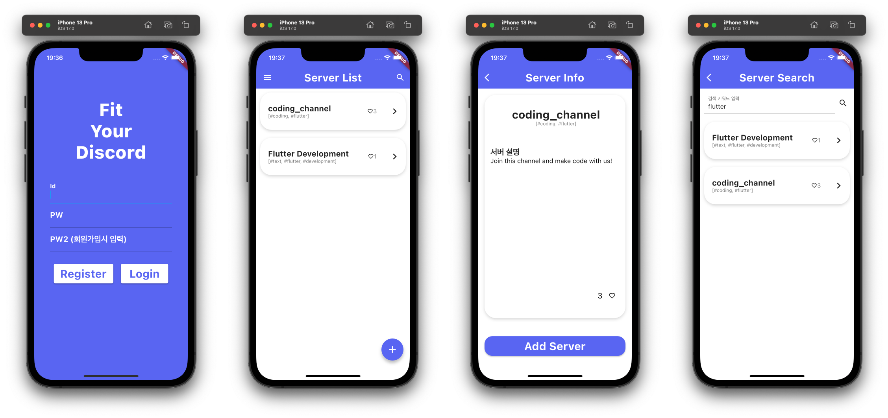

Fit Your Discord!

## 프로젝트 정보

**Flutter/Dart를 공부하기 위해 진행한 프로젝트입니다.**

- 23-2 Fullstack service programming term project.
- 2023.09 ~ 2023.12

## 프로젝트 소개

**원하는 서버를 찾고, 만들어서 다른사람에게 알리세요!**

Discord는 친구와 잡담/게임, 공통 취미를 가진 사람과의 교류, 정보 교환, 사이버 독서실 등 다양한 목적으로 사용됩니다.

> 그렇다면, 필요로 하는 서버를 찾고, 같은 목적을 가진 유저에게 홍보하는 광장이 있다면 서로 좋겠죠?

FYD(Fit Your Discord)는 이 이유로 만들어졌습니다! FYD로 여러분들의 목적에 맞는 서버들을 Discord에 추가해봐요!

## 프로젝트 기능

1. 홍보 서버 등록
   - 태그와 자세한 설명으로 어떤 서버인지 알려보아요.
2. 좋아요 기능
   - 좋아요 버튼을 통해 서버가 인기를 얻도록 도와주세요!
   - 좋아요 버튼을 누른 서버만 모아서 볼 수도 있답니다.
3. 검색 기능
   - 서버명/태그 검색을 통해 원하는 서버를 빠르게 찾아보아요.

## 기술 스택

- 환경
  - Visual Studio Code
  - Git
  - Github
- 개발
  - Flutter/Dart
  - Material UI
- UI Design Tool
  - Adobe XD

## 스크린샷

## 관련 링크

- [FYD Backend Repo(Github)](https://github.com/DevLeti/fyd-backend)
- [Demo Video(Youtube, Korean)](https://youtu.be/R_ejI1sXtXw)
